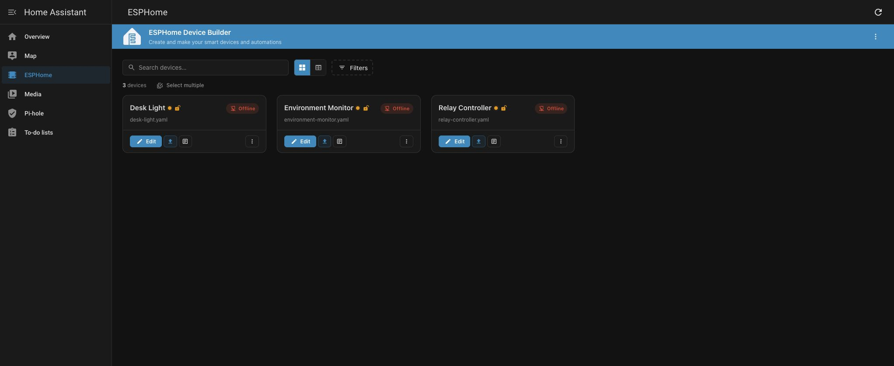
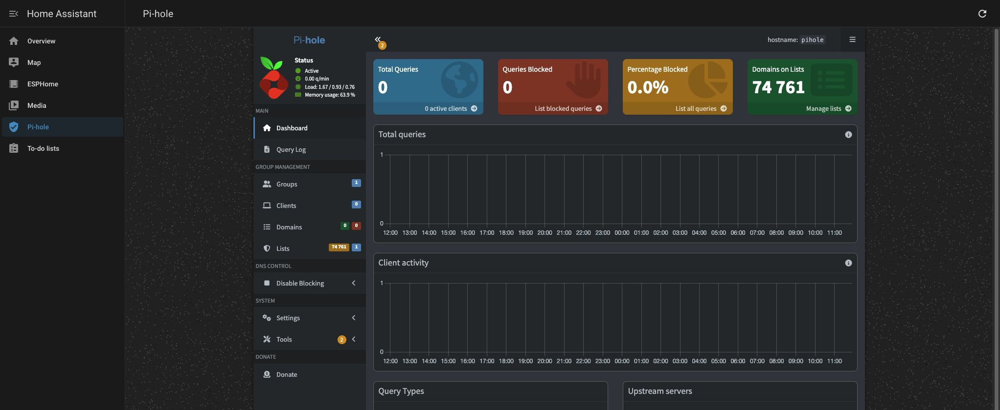
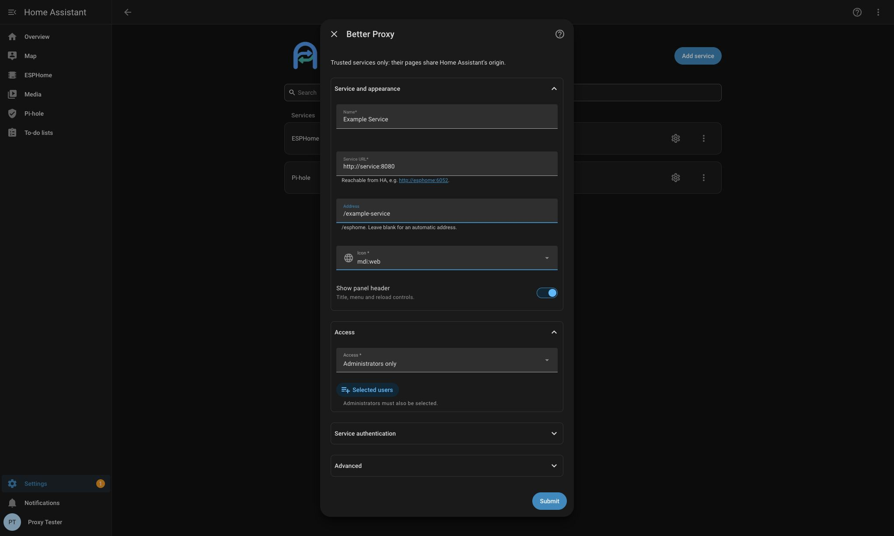

<p align="center">
  
</p>

<h1 align="center">Better Proxy</h1>

<p align="center">Reverse proxy for HTTP services in Home Assistant.</p>

<p align="center">
  <a href="#screenshots">Screenshots</a> ·
  <a href="#installation">Installation</a> ·
  <a href="#configuration">Configuration</a> ·
  <a href="#security">Security</a> ·
  <a href="#compatibility">Compatibility</a> ·
  <a href="#development">Development</a>
</p>

Better Proxy displays HTTP and HTTPS services in Home Assistant sidebar panels. Home Assistant forwards requests to each service and applies the access rules configured for that entry. Remote access uses the existing Home Assistant connection. The integration does not require Home Assistant Supervisor.

## Screenshots

Examples of service panels displayed through Better Proxy. ESPHome uses example configurations without connected hardware; Pi-hole has no network clients or DNS traffic.





Add a service and configure its appearance, access rules, authentication and proxy options in Home Assistant.



## Installation

Requirements: Home Assistant 2025.10.1 or later and network access from Home Assistant to the service. Home Assistant 2026.3 or later is required to display the local integration icon.

### HACS

HACS installation requires a public repository that meets the [HACS integration requirements](https://www.hacs.xyz/docs/publish/integration/). Private repositories require manual installation.

[](https://my.home-assistant.io/redirect/hacs_repository/?owner=wojciechkrol&repository=ha_better_proxy&category=integration)

To add the repository manually in HACS:

1. Open **HACS → ⋮ → Custom repositories**.
2. Add `https://github.com/wojciechkrol/ha_better_proxy` with type **Integration**.
3. Open **Better Proxy** in HACS and select **Download**.
4. Restart Home Assistant.

### Manual installation

1. Download the [installation archive](https://github.com/wojciechkrol/ha_better_proxy/releases/download/v1.0.0/better-proxy-1.0.0.zip) or clone this repository.
2. Copy `custom_components/better_proxy` into the Home Assistant configuration directory:

   ```text
   config/
   └── custom_components/
       └── better_proxy/
           ├── manifest.json
           ├── __init__.py
           ├── frontend/
           ├── translations/
           └── brand/
   ```

3. Restart Home Assistant.

### Setup

After installation, open **Settings → Devices & services → Add integration** and select **Better Proxy**.

Configuration is managed in the Home Assistant UI. No `configuration.yaml` entries are required.

### Updates

- **HACS:** open Better Proxy in HACS and download the new version.
- **Manual:** replace `custom_components/better_proxy` with the directory from the new release.

Restart Home Assistant after updating.

## Configuration

Add one entry per service. Select **Configure** on an existing entry to edit its settings.

### Service and appearance

| Setting | Description |
| --- | --- |
| Name | Sidebar label and panel title. |
| Service URL | HTTP or HTTPS address reachable from the Home Assistant process or container. A base path is allowed; embedded credentials, query strings and fragments are not. |
| Address | Optional path in Home Assistant, e.g. `/esphome`. Start with `/`, followed by lowercase letters, digits, hyphens or underscores. Leave blank to use the automatic address. Reserved or occupied paths are rejected. |
| Icon | Sidebar icon. |
| Show panel header | Show the title, menu and reload controls. Enabled by default. |

Container hostnames require a shared Docker network with DNS resolution.

### Access

| Mode | Authorized accounts |
| --- | --- |
| Administrators only | Active Home Assistant administrators. Default. |
| All signed-in users | All active, non-system Home Assistant accounts. |
| Selected users | Accounts explicitly selected in the list. Administrators must also be selected. |

Entries are hidden from unauthorized users' sidebars. The server also checks access to direct proxy requests. Home Assistant administrators can manage entries regardless of the selected access mode.

### Service authentication

| Mode | Configuration |
| --- | --- |
| Application login | No credentials supplied by the proxy. The service handles login. |
| Basic Auth | Service username and password. Without a username, the service handles login. Default. |
| Digest Auth | Service username and password. |
| Bearer token | Service access token. |

Configured credentials take precedence over authentication headers supplied by the application. Home Assistant authentication and service authentication are separate; access to a panel does not bypass the service's login requirements.

### Advanced

| Setting | Description |
| --- | --- |
| Verify TLS certificate | Verify the service's HTTPS certificate. Enabled by default. Disabling verification permits invalid or self-signed certificates. |
| Rewrite application URLs | Map application URLs and browser requests to the proxy path. Enabled by default. Disable for services that handle the proxy path themselves. |

Saving changes invalidates the entry's proxy sessions and closes its active connections. Reopen the panel to establish a new session.

Configuration and panel messages follow the Home Assistant language setting. Translations are included for 36 locales, with English as the fallback.

## Security

**Only trusted services should be configured.** Proxied pages share Home Assistant's origin. Their scripts can access Home Assistant frontend data and other service panels available to the same user. Per-entry access rules do not isolate application scripts from Home Assistant.

Passwords and service tokens are stored without additional encryption in `.storage/core.config_entries`. They are masked in configuration forms. The Home Assistant token used to authenticate the panel is not forwarded to the service or placed in the iframe URL.

HTTPS at the Home Assistant endpoint protects the browser connection. A service URL using HTTP leaves traffic between Home Assistant and that service unencrypted.

Proxy sessions:

- Require an active, authorized Home Assistant account and a valid HA refresh token.
- Use `HttpOnly`, `SameSite=Strict` cookies scoped to the entry's path, with `Secure` on HTTPS connections.
- Expire after 30 minutes of inactivity or 12 hours in total. An open panel renews its session every minute.
- Lose access when the refresh token is revoked, the account is disabled or the entry's settings change. Active connections are checked every five seconds.
- Are cleared when Home Assistant restarts. Closing a tab does not revoke the session.

Application cookies are namespaced per entry and proxy session. Rewritten responses use a replacement Content Security Policy and frame headers to permit embedding in Home Assistant.

## Compatibility

| Supported | Scope |
| --- | --- |
| HTTP methods | GET, HEAD, POST, PUT, PATCH, DELETE and OPTIONS. |
| Requests and responses | Query strings, forms, multipart uploads, downloads, HTTP Range and streamed responses. |
| Persistent connections | WebSocket text and binary messages, subprotocol negotiation and server-sent events. |
| Media over HTTP | MJPEG streams and HLS playlists, segments and keys on the configured service host. |
| URL rewriting | HTML and CSS URLs, redirects, refresh headers, form actions and HLS references. An injected script maps fetch, XHR, WebSocket, EventSource, history and dynamic DOM URLs. |
| Cookies | HTTP cookies preserve expiry, deletion, HttpOnly, Secure and SameSite attributes. JavaScript-managed cookie mapping requires URL rewriting. |

The proxy sends `X-Ingress-Path`, `X-Forwarded-Prefix`, `X-Forwarded-Host` and `X-Forwarded-Proto` headers. Known request lengths are preserved for services that cannot accept chunked uploads.

| Limitation | Details |
| --- | --- |
| Applications using a root path | URL rewriting cannot adapt every application. JavaScript and JSON response bodies remain unchanged; hard-coded root-relative module imports require application support. |
| Other hosts | URLs pointing to other hosts, including aliases of the configured service, are not automatically proxied. |
| JavaScript navigation | Mapping `location.href`, `assign()` and `replace()` requires browser Navigation API support. |
| Workers | Service worker registration is blocked. Rewritten responses also block workers through Content Security Policy. |
| External authentication | OAuth, SSO and logins involving other domains may require application-specific configuration. |
| Non-HTTP media | No RTSP, RTMP, UDP or WebRTC media relay; no transcoding. |
| Rewritten responses | Maximum text resource size: 8 MiB. |
| Digest uploads | Maximum buffered request body: 64 MiB. |
| WebSocket messages | Maximum message size: 16 MiB. |
| Mobile safe areas | The panel handles top and side insets. The embedded application must handle its own bottom controls and inset. |
| Home Assistant updates | Sidebar filtering uses the internal `get_panels` command and may require changes after Home Assistant updates. |

## Development

Development and tests use Home Assistant's `stable` Docker image. The `docker compose up` and `run` commands pull the latest image. Integration code is mounted read-only; Home Assistant configuration is stored in a named volume.

```sh
# Start Home Assistant and the internal demo service
docker compose -f compose.dev.yaml up -d

# Run backend tests, lint and formatting checks
docker compose -f compose.dev.yaml --profile test run --rm tests

# Build the installation archive in dist/
python3 scripts/build_release.py
```

Open `http://127.0.0.1:18765`, create a test account and add `http://demo:18766` as a service. The demo has no published host port.

To run ESPHome and Pi-hole on the same Docker network:

```sh
docker compose -f compose.dev.yaml --profile examples up -d esphome pihole
```

Add `http://esphome:6052` and `http://pihole` as Better Proxy services. Neither container publishes host ports. The Pi-hole example has application authentication disabled; keep its panel restricted to administrators. These containers store their configuration in named volumes.

Recreate the development instance after Python changes:

```sh
docker compose -f compose.dev.yaml up -d --force-recreate homeassistant
```

Stop the environment with `docker compose -f compose.dev.yaml down`. Adding `--volumes` deletes its stored configuration and accounts.

---

[Releases](https://github.com/wojciechkrol/ha_better_proxy/releases) · [Issues](https://github.com/wojciechkrol/ha_better_proxy/issues) · [MIT License](LICENSE)
